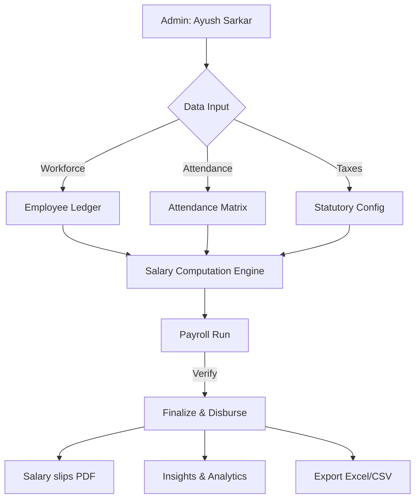

# 🏢 PayrollPro — Enterprise Payroll Management

[](https://nextjs.org/)
[](https://www.typescriptlang.org/)
[](https://tailwindcss.com/)
[](LICENSE)

**PayrollPro** is a modern, enterprise-grade SaaS platform designed to simplify Indian payroll complexity. Built for high-growth companies, it automates salary calculations, tax compliance (PF/ESI/TDS), and employee workforce management.

---

## 📊 System Overview

### **How it Works (The Flow)**



### **Core Features**

| Feature | Description |
| :--- | :--- |
| **Salary Engine** | High-precision Indian payroll logic (Basic, HRA, DA, Special Allowance). |
| **Tax Compliance** | Automatic PF (EPFO), ESI (ESIC), and TDS calculation (Surcharge + Cess). |
| **Regime Comparison** | Live comparison between **New vs. Old Tax Regimes** for employees. |
| **Data Export** | One-click export for Workforce (Excel) and Attendance (CSV). |
| **Insights** | Visual analytics for disbursement trends and department costs. |
| **PDF Generation** | Real-time generation of Salary Slips and Tax Reports. |

---

## 🚀 Getting Started

### **1. Installation**

Clone the repository and install dependencies:

```bash
git clone https://github.com/Ayushnot41/payrolpro.git
cd payrolpro
npm install
```

### **2. Development Mode**

Run the local development server:

```bash
npm run dev
```

The application will be live at `http://localhost:3000`.

### **3. Production Build**

```bash
npm run build
npm start
```

---

## 🛠️ Technology Stack

*   **Frontend**: Next.js 14 (App Router), Tailwind CSS, Shadcn UI.
*   **State Management**: Zustand (Auth & UI Persistence).
*   **Charts**: Recharts (High-fidelity data visualization).
*   **PDF/Export**: jsPDF, html2canvas (PDF), XLSX (Excel), PapaParse (CSV).
*   **Calculations**: Custom-built `salary-engine.ts` for Indian statutory compliance.

---

## 🔒 Administrative Identity

The platform is strictly configured for administrator **Ayush Sarkar**. All payroll disbursements, reports, and system audit logs are hard-coded to this administrative identity to ensure enterprise-level consistency.

---

## 🏗️ Project Structure

```text
src/
├── app/            # Next.js App Router (Pages & API)
├── components/     # UI Design System (Shadcn + Custom)
├── lib/            
│   ├── salary-engine.ts  # Core computation logic
│   ├── db/               # In-memory database (singleton)
│   └── utils.ts          # Formatting & PDF helpers
└── store/          # Global application state (Zustand)
```

---

## ⚖️ License

Distributed under the MIT License. See `LICENSE` for more information.

---
**Developed by Ayush Sarkar**  
*Building the future of workforce management.*
